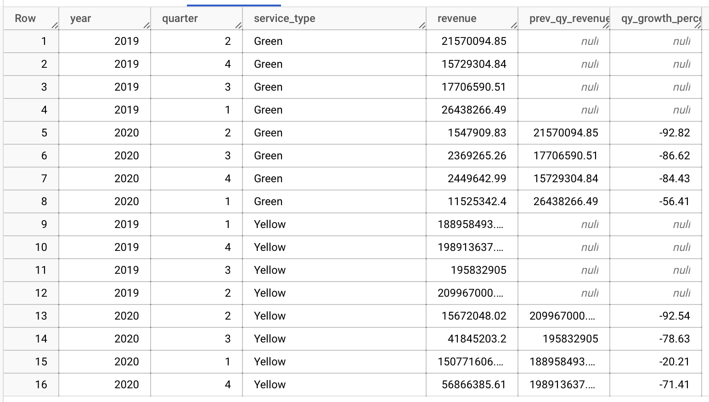

# HW 4

## Environment Setup

Used kestra workflow orchestration to set up green taxi data 2019-2020, yellow taxi data 2019-2020 and for-hire-vehicle (fhv) data 2019 in GCP Storage Bucket and Google BigQuery.

Make Table
Data | Records
Green Taxi Data 2019-2020 | 7,778,101
Yellow Taxi Data 2019-2020 | 109,047,518
FHV Data 2019 | 43,244,696

Set up dbt to be used in BigQuery

## Q1: Understanding dbt model resolution

Provided you've got the following sources.yaml
```yaml
version: 2

sources:
  - name: raw_nyc_tripdata
    database: "{{ env_var('DBT_BIGQUERY_PROJECT', 'dtc_zoomcamp_2025') }}"
    schema:   "{{ env_var('DBT_BIGQUERY_SOURCE_DATASET', 'raw_nyc_tripdata') }}"
    tables:
      - name: ext_green_taxi
      - name: ext_yellow_taxi
```

with the following env variables setup where `dbt` runs:
```shell
export DBT_BIGQUERY_PROJECT=myproject
export DBT_BIGQUERY_DATASET=my_nyc_tripdata
```

What does this .sql model compile to?
```sql
select * 
from {{ source('raw_nyc_tripdata', 'ext_green_taxi' ) }}
```

- `select * from dtc_zoomcamp_2025.raw_nyc_tripdata.ext_green_taxi`
- `select * from dtc_zoomcamp_2025.my_nyc_tripdata.ext_green_taxi`
- `select * from myproject.raw_nyc_tripdata.ext_green_taxi`
- `select * from myproject.my_nyc_tripdata.ext_green_taxi`
- `select * from dtc_zoomcamp_2025.raw_nyc_tripdata.green_taxi`

Answer `select * from dtc_zoomcamp_2025.raw_nyc_tripdata.green_taxi`

## Q2: dbt Variables & Dynamic Models

Say you have to modify the following dbt_model (`fct_recent_taxi_trips.sql`) to enable Analytics Engineers to dynamically control the date range.

- In development, you want to process only **the last 7 days of trips**
- In production, you need to process **the last 30 days** for analytics

```sql
select *
from {{ ref('fact_taxi_trips') }}
where pickup_datetime >= CURRENT_DATE - INTERVAL '30' DAY
```

What would you change to accomplish that in a such way that command line arguments takes precedence over ENV_VARs, which takes precedence over DEFAULT value?

- Add `ORDER BY pickup_datetime DESC` and `LIMIT {{ var("days_back", 30) }}`
- Update the WHERE clause to `pickup_datetime >= CURRENT_DATE - INTERVAL '{{ var("days_back", 30) }}' DAY`
- Update the WHERE clause to `pickup_datetime >= CURRENT_DATE - INTERVAL '{{ env_var("DAYS_BACK", "30") }}' DAY`
- Update the WHERE clause to `pickup_datetime >= CURRENT_DATE - INTERVAL '{{ var("days_back", env_var("DAYS_BACK", "30")) }}' DAY`
- Update the WHERE clause to `pickup_datetime >= CURRENT_DATE - INTERVAL '{{ env_var("DAYS_BACK", var("days_back", "30")) }}' DAY`

Answer

## Q3: dbt Data Lineage and Execution

Considering the data lineage below **and** that taxi_zone_lookup is the **only** materialization build (from a .csv seed file):


Select the option that does **NOT** apply for materializing `fct_taxi_monthly_zone_revenue`:

- `dbt run`
- `dbt run --select +models/core/dim_taxi_trips.sql+ --target prod`
- `dbt run --select +models/core/fct_taxi_monthly_zone_revenue.sql`
- `dbt run --select +models/core/`
- `dbt run --select models/staging/+`

Answer: `dbt run --select models/staging/+`
 
 ## Q4: dbt Macros and Jinja

Consider you're dealing with sensitive data (e.g.: [PII](https://en.wikipedia.org/wiki/Personal_data)), that is **only available to your team and very selected few individuals**, in the `raw layer` of your DWH (e.g: a specific BigQuery dataset or PostgreSQL schema), 

 - Among other things, you decide to obfuscate/masquerade that data through your staging models, and make it available in a different schema (a `staging layer`) for other Data/Analytics Engineers to explore

- And **optionally**, yet  another layer (`service layer`), where you'll build your dimension (`dim_`) and fact (`fct_`) tables (assuming the [Star Schema dimensional modeling](https://www.databricks.com/glossary/star-schema)) for Dashboarding and for Tech Product Owners/Managers

You decide to make a macro to wrap a logic around it:

```sql


    
    

     {{- env_var(target_env_var) -}}
                        {{- env_var(stging_env_var, env_var(target_env_var)) -}}
    


```

And use on your staging, dim_ and fact_ models as:
```sql
{{ config(
    schema=resolve_schema_for('core'), 
) }}
```

That all being said, regarding macro above, **select all statements that are true to the models using it**:
- Setting a value for  `DBT_BIGQUERY_TARGET_DATASET` env var is mandatory, or it'll fail to compile
- Setting a value for `DBT_BIGQUERY_STAGING_DATASET` env var is mandatory, or it'll fail to compile
- When using `core`, it materializes in the dataset defined in `DBT_BIGQUERY_TARGET_DATASET`
- When using `stg`, it materializes in the dataset defined in `DBT_BIGQUERY_STAGING_DATASET`, or defaults to `DBT_BIGQUERY_TARGET_DATASET`
- When using `staging`, it materializes in the dataset defined in `DBT_BIGQUERY_STAGING_DATASET`, or defaults to `DBT_BIGQUERY_TARGET_DATASET`

Answer


## Q5:  Taxi Quarterly Revenue Growth

1. Create a new model `fct_taxi_trips_quarterly_revenue.sql`
2. Compute the Quarterly Revenues for each year for based on `total_amount`
3. Compute the Quarterly YoY (Year-over-Year) revenue growth 
  * e.g.: In 2020/Q1, Green Taxi had -12.34% revenue growth compared to 2019/Q1
  * e.g.: In 2020/Q4, Yellow Taxi had +34.56% revenue growth compared to 2019/Q4

```sql
{{ config(materialized='table') }}

with quarterly_revenue AS (
    SELECT
        service_type,
        EXTRACT(YEAR FROM pickup_datetime) AS year,
        EXTRACT(QUARTER FROM pickup_datetime) AS quarter,
        SUM(total_amount) AS revenue
    FROM {{ref('fact_trips')}}
    WHERE EXTRACT(YEAR FROM pickup_datetime) IN (2019, 2020)
    GROUP BY service_type, year, quarter
),

quarterly_compare AS (
    SELECT
        service_type,
        year, 
        quarter,
        revenue,
        LAG(revenue) OVER (
            PARTITION BY service_type, quarter ORDER BY year
        ) AS prev_quarter_revenue,
        ROUND (
            100 * (revenue - LAG(revenue) OVER (
                PARTITION BY service_type, quarter ORDER BY year
            )) / NULLIF(LAG(revenue) OVER (
                PARTITION BY service_type, quarter ORDER BY year
            ), 0), 2
        ) AS qy_growth_percent
    FROM quarterly_revenue
)

SELECT * FROM quarterly_compare
```

run command
```
dbt build --select fct_taxi_trips_quarterly_revenue
```

Considering the YoY Growth in 2020, which were the yearly quarters with the best (or less worse) and worst results for green, and yellow

- green: {best: 2020/Q2, worst: 2020/Q1}, yellow: {best: 2020/Q2, worst: 2020/Q1}
- green: {best: 2020/Q2, worst: 2020/Q1}, yellow: {best: 2020/Q3, worst: 2020/Q4}
- green: {best: 2020/Q1, worst: 2020/Q2}, yellow: {best: 2020/Q2, worst: 2020/Q1}
- green: {best: 2020/Q1, worst: 2020/Q2}, yellow: {best: 2020/Q1, worst: 2020/Q2}
- green: {best: 2020/Q1, worst: 2020/Q2}, yellow: {best: 2020/Q3, worst: 2020/Q4}



Answer green: {best: 2020/Q1, worst: 2020/Q2}, yellow: {best: 2020/Q1, worst: 2020/Q2}

## Q6: : P97/P95/P90 Taxi Monthly Fare

1. Create a new model `fct_taxi_trips_monthly_fare_p95.sql`
2. Filter out invalid entries (`fare_amount > 0`, `trip_distance > 0`, and `payment_type_description in ('Cash', 'Credit Card')`)
3. Compute the **continous percentile** of `fare_amount` partitioning by service_type, year and and month

```sql
{{ config(materialized='table') }}

with filtered_trips AS (
    SELECT
        service_type,
        EXTRACT(YEAR FROM pickup_datetime) AS year,
        EXTRACT(MONTH FROM pickup_datetime) AS month,
        fare_amount
    FROM {{ ref('fact_trips') }}
    WHERE
        fare_amount > 0
        AND trip_distance > 0
        AND payment_type_description IN ('Cash', 'Credit card')
)

SELECT
    service_type,
    year,
    month,
    PERCENTILE_CONT(fare_amount, 0.90)
        OVER (PARTITION BY service_type, year, month) AS fare_p90,
    PERCENTILE_CONT(fare_amount, 0.95) 
        OVER (PARTITION BY service_type, year, month) AS fare_p95,
    PERCENTILE_CONT(fare_amount, 0.97)
        OVER (PARTITION BY service_type, year, month) AS fare_p97
FROM filtered_trips
ORDER BY service_type, year, month
```

Now, what are the values of `p97`, `p95`, `p90` for Green Taxi and Yellow Taxi, in April 2020?

```sql
SELECT
  service_type,
  year,
  month,
  fare_p97,
  fare_p95,
  fare_p90
FROM `ny-taxi-451623.dbt_michellea.fct_taxi_trips_monthly_fare_p95`
WHERE year = 2020 AND month = 4
```

- green: {p97: 55.0, p95: 45.0, p90: 26.5}, yellow: {p97: 52.0, p95: 37.0, p90: 25.5}
- green: {p97: 55.0, p95: 45.0, p90: 26.5}, yellow: {p97: 31.5, p95: 25.5, p90: 19.0}
- green: {p97: 40.0, p95: 33.0, p90: 24.5}, yellow: {p97: 52.0, p95: 37.0, p90: 25.5}
- green: {p97: 40.0, p95: 33.0, p90: 24.5}, yellow: {p97: 31.5, p95: 25.5, p90: 19.0}
- green: {p97: 55.0, p95: 45.0, p90: 26.5}, yellow: {p97: 52.0, p95: 25.5, p90: 19.0}

Answer green: {p97: 55.0, p95: 45.0, p90: 26.5}, yellow: {p97: 31.5, p95: 25.5, p90: 19.0}

## Q7: Top #Nth longest P90 travel time Location for FHV

Prerequisites:
* Create a staging model for FHV Data (2019), and **DO NOT** add a deduplication step, just filter out the entries where `where dispatching_base_num is not null`

```sql
{{
    config(
        materialized='view'
    )
}}

with tripdata as 
(
  select *,
    row_number() over(partition by Dispatching_base_num, Pickup_datetime) as rn
  from {{ source('staging','fhv_tripdata') }}
  where Dispatching_base_num is not null 
)
select
    -- identifiers
    {{ dbt_utils.generate_surrogate_key(['Dispatching_base_num', 'Pickup_datetime']) }} as tripid,
    {{ dbt.safe_cast("Dispatching_base_num", api.Column.translate_type("string")) }} as dispatching_base_num,
    {{ dbt.safe_cast("PUlocationid", api.Column.translate_type("integer")) }} as pickup_locationid,
    {{ dbt.safe_cast("DOlocationid", api.Column.translate_type("integer")) }} as dropoff_locationid,

    -- timestamps
    cast(Pickup_datetime as timestamp) as pickup_datetime,
    cast(DropOff_datetime as timestamp) as dropoff_datetime,

    -- trip info
    SR_Flag
from tripdata
where rn = 1 
```

* Create a core model for FHV Data (`dim_fhv_trips.sql`) joining with `dim_zones`. Similar to what has been done [here](../../../04-analytics-engineering/taxi_rides_ny/models/core/fact_trips.sql)
* Add some new dimensions `year` (e.g.: 2019) and `month` (e.g.: 1, 2, ..., 12), based on `pickup_datetime`, to the core model to facilitate filtering for your queries
* compute the [timestamp_diff](https://cloud.google.com/bigquery/docs/reference/standard-sql/timestamp_functions#timestamp_diff) in seconds between dropoff_datetime and pickup_datetime - we'll call it `trip_duration` for this exercise

```sql
{{ config(materialized='table') }}

with fhv_tripdata as (
    select *,
        'FHV' as service_type
    from {{ ref('stg_fhv_tripdata') }}
),
dim_zones as (
    select * from {{ ref('dim_zones') }}
    where borough != "Unknown"
)
select
    fhv_tripdata.dispatching_base_num,
    fhv_tripdata.service_type,
    EXTRACT(year FROM fhv_tripdata.pickup_datetime) as year,
    EXTRACT(month FROM fhv_tripdata.pickup_datetime) as month,
    fhv_tripdata.pickup_locationid,
    pickup_zone.borough as pickup_borough,
    pickup_zone.zone as pickup_zone,
    fhv_tripdata.dropoff_locationid,
    dropoff_zone.borough as dropoff_borough,
    dropoff_zone.zone as dropoff_zone,
    fhv_tripdata.pickup_datetime,
    fhv_tripdata.dropoff_datetime,
    timestamp_diff(fhv_tripdata.dropoff_datetime, fhv_tripdata.pickup_datetime, SECOND) as trip_duration,
    fhv_tripdata.SR_Flag
from fhv_tripdata
inner join dim_zones as pickup_zone
on fhv_tripdata.pickup_locationid = pickup_zone.locationid
inner join dim_zones as dropoff_zone
on fhv_tripdata.dropoff_locationid = dropoff_zone.locationid
```

Now...
1. Create a new model `fct_fhv_monthly_zone_traveltime_p90.sql`
2. Compute the **continous** `p90` of `trip_duration` partitioning by year, month, pickup_location_id, and dropoff_location_id

For the Trips that **respectively** started from `Newark Airport`, `SoHo`, and `Yorkville East`, in November 2019, what are **dropoff_zones** with the 2nd longest p90 trip_duration ?

```sql
{{ config(materialized='table') }}

with duration_data as (
    select * from {{ ref('dim_fhv_trips') }}
)

select
    service_type,
    year,
    month,
    pickup_locationid,
    pickup_zone,
    dropoff_locationid,
    dropoff_zone,
    PERCENTILE_CONT(trip_duration, 0.9) OVER (PARTITION BY year, month, pickup_locationid, dropoff_locationid) as duration_p90
from duration_data
where month = 11
    AND pickup_zone in ('Newark Airport', 'SoHo', 'Yorkville East')
order by duration_p90 DESC
```

- LaGuardia Airport, Chinatown, Garment District
- LaGuardia Airport, Park Slope, Clinton East
- LaGuardia Airport, Saint Albans, Howard Beach
- LaGuardia Airport, Rosedale, Bath Beach
- LaGuardia Airport, Yorkville East, Greenpoint
 
 Answer LaGuardia Airport, Chinatown, Garment District
